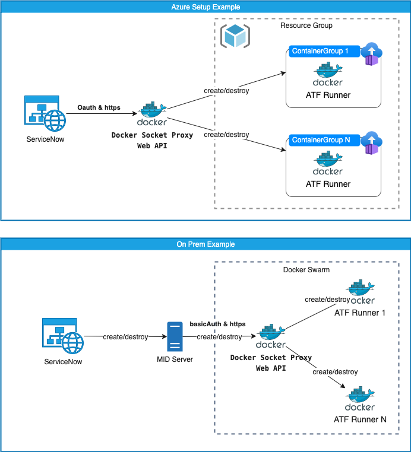

# Docker Socket Proxy (DSP) for ServiceNow ATF Headless Browser Integration

## Table of Contents

- [Introduction](#introduction)
- [Requirements](#requirements)
- [Setup](#setup)
  - [ServiceNow](#servicenow)
    - [Sys Properties](#sys-properties)
  - [Authentication](#authentication)
    - [Basic Auth](#basic-auth)
    - [Oauth Client Credentials flow with Azure](#oauth-client-credentials-flow-with-azure)
  - [Azure Container Group Settings](#azure-container-group-settings)
  - [Run the Docker Socket Proxy](#run-the-docker-socket-proxy)
- [K8s Liveness Probes](#k8s-liveness-probes)

## Introduction

By design, ServiceNow [ATF Headless Browser integration](https://docs.servicenow.com/bundle/rome-application-development/page/administer/auto-test-framework/concept/atf-headless-browser.html) requires:

- a VM with Dockerd, swarm enabled
- the docker host to be public available
- the dockerd unix socket to be shared to the public (via Mutual Auth)

Unfortunately the OOB solution does not:

- integrate with cloud container service providers (Azure, AWS, etc)
- work with on-prem VM (Mutual Auth is not available via MID server)

This Docker Socket Proxy exposes a REST API (with the same endpoints as the docker daemon) to create, monitor and delete the headless browser container and forwards these requests to services like:

- dockerd on a local VM (swarm enabled to lb over multiple VM)
- Azure to start the containers in the cloud
- AWS (tbd)

The integration landscape is:

1. ATF scheduler run in ServiceNow
2. Headless Docker request via MID server to this DSP REST API
3. DSP forward request to container service like
   - dockerd (wia unix socket)
   - Azure (via [REST Api](https://docs.microsoft.com/en-us/rest/api/container-instances/))



## Requirements

- A running Docker Socket Proxy instance running (this project). The container can be installed on prem (requires MID server) or on cloud. In both cases a reverse proxy/ingress is required to terminate TLS (e.g [traefik](https://traefik.io) or [nginx](https://www.nginx.com)).
- A Docker runtime environment, either:
  - Local: running on the same host as the DSP in Swarm mode (connected via /var/run/docker.sock).
  - Cloud: Azure credentials to start the containers in the cloud.
- ServiceNow ATF runner configured to use the DSP
  - credentials in ServiceNow to connect to the DSP (Oauth or BasicAuth)

## Setup

### ServiceNow

1. Read (just read, don't follow all of it) all the ServiceNow [Headless Browser for Automated Test Framework](https://docs.servicenow.com/bundle/rome-application-development/page/administer/auto-test-framework/concept/atf-headless-browser.html) guide ton configure the instance to automatically request a new ATF Docker container for scheduled ATF runs.

2. As the integration with docker is done by this proxy, there is no need to configure ServiceNow to connect to the Docker socket via MutualAuth. So no need to create mTls (mutual auth) certificates.
   However, there is a need to configure credentials in the ServiceNow instance to authenticate against the DSP. There are two ways to do this:

   - Basic Auth:
      1. Navigate to **Connections & Credentials > Credentials** to open the **discovery_credentials** table.
      2. Select **New > Basic Auth Credentials**
      3. Fill in these fields:
         - Name: Any text you prefer
         - Username: The username to use for authentication
         - Password: The password to use for authentication
         - Select Submit.
   - OAuth:
      1. Navigate to **System OAuth > Application Registry** to open the **discovery_credentials** table.
      2. Select **New > Connect to an OAuth Provider (simplified)**
      3. Fill in these fields:
         - Name: Any text you prefer
         - Client ID: The **Client ID** to use for authentication
         - Client Secret: The **Client secret** to use for authentication
         - Default Grant type: **Client Credentials**
         - Token Url: The URL to use for authentication (e.g. `https://login.microsoftonline.com/<tenant-id>/oauth2/v2.0/token`)
         - Select Save (not Submit) and stay on the page.
         - A **Oauth Entity Profile** was automatically added with name of the application registry ending with **_default_profile**.
         - Open this **Oauth Entity Profile** and click on **insert a new row...** to add a scope.
         - Select **New**
         - Fill in these fields:
            - Name: **default**
            - Oauth Provider: the name of the application registry you created in the beginning of step 3.
            - Scope: The name of the scope. (e.g. `api://00000000-1111-0000-111111111111111111/.default`)
            - Select Submit.
         - Select this default profile.
         - Select Update.
      4. Navigate to **Connections & Credentials > Credentials** to open the **discovery_credentials** table.
      5. Select **New > OAuth 2.0 Credentials**
      6. Fill in these fields:
         - Name: Any text you prefer
         - Oauth Profile: The **Oauth Entity Profile** from step 3 (by default ending with **_default_profile**).
         - Applies to: all MID servers
         - Select Save (not Submit) and stay on the page.
      7. Click on **Get OAuth TokenGet OAuth Token** to verify the credentials.
3. Now configure ServiceNow to use the credentials you created in step 2 to authenticate against the DSP. The steps below are similar to the [Set up your instance for Headless Browser in Linux](https://docs.servicenow.com/bundle/rome-application-development/page/administer/auto-test-framework/task/headless-browser-instance-setup.html) guide but don't require any certificate to be created.
   1. Create a Connections alias: Navigate to **Connections & Credentials > Connection & Credential Aliases** to open the **sys_alias** table.
   2. Select the alias with the name **Docker**.
   3. Under the Connections related list, select **New**.
   4. Fill in these fields:
      - Name: Any text you prefer
      - Credential field: Select the credential field you created in step 2 (BasicAuth or Oauth).
      - Select the URL Builder check box.
      - Make sure the Mutual authentication check box is **unchecked**.
      - Check **Use MID server** if this proxy service runs in your internal network
      - In the Host field, add the Host name of your server.
      - In case this proxy is not running on the default port (443) specify the port in the **Override default port** filed
      - Select Submit.
        The Connection URL is automatically created by the system.

#### Sys Properties

Ensure following sys properties exist and are set:

- sn_atf.headless.retry_count: 50
- sn_atf.headless.request_timeout_sec: 120
- sn_atf.headless.images_check.enabled: false (disables the image-exists check)

### Authentication

#### Basic Auth

The simplest way to authenticate against the DSP is to use Basic Auth. Use `htpasswd` to create a .htpasswd password with credentials like:
`htpasswd -c -B .htpasswd username`

#### Oauth Client Credentials flow with Azure

1. Create a 'Provider' Service Principal in Azure and add an 'App Role' to it:

   - Navigate to 'App roles' and click 'Create App Role':
     - Display name: 'dockerProxy.admin'
     - Allowed member types: 'Applications'
     - Value: 'dockerProxy.admin'
     - Description: 'grant permission to manage docker containers via api'

   Note down the Azure ID's below to be used in the AUTH_AZURE_* variables:

   - `AUTH_AZURE_TENANT_ID` = The Azure tenant ID ([how-to](https://docs.microsoft.com/en-us/azure/active-directory/fundamentals/active-directory-how-to-find-tenant))
   - `AUTH_AZURE_CLIENT_ID` = Application (client) ID
   - `AUTH_AZURE_ROLE` = 'dockerProxy.admin'

2. Create a 'Consumer' Service Principal in Azure:
   The 'Consumer' SP is used in ServiceNow to request an OAuth token.
   - Navigate to 'Certificates & secrets' and click 'New client secret'
     - Description: Any text you prefer
     - Expires: '24 Month' (if you want a long-term credential use the [Azure CLI](https://stackoverflow.com/questions/67075017/azure-app-registration-client-secrets-expiration))
     - Select 'Add'
     - Note down the 'Value', it will be used in the Oauth Setup in ServiceNow as the **client secret**

   - Navigate to 'API permissions' to add the 'dockerProxy.admin' role to the 'Consumer' Service Principal and click 'Add a permission'
     - Select 'My APIs'
     - Select the 'Provider' Service Principal you created in step 1
     - Select 'Application Permissions'
     - Select 'dockerProxy.admin'
     - Select 'Add permission'

   - Note down following to configure the Oauth Setup in ServiceNow:
     - The Tenant ID ([how-to](https://docs.microsoft.com/en-us/azure/active-directory/fundamentals/active-directory-how-to-find-tenant))
     - The Application (client) ID
     - The Client secret

### Azure Container Group Settings

The proxy is creating container instances in Azure (which need to be in a container group). To be able to do this the proxy also needs to have a service principal (you could also use the 'Provider' principal if you like).

Furthermore a 'resource group' and a nearby 'resource location' is required. Follow below steps to create the required resources:

- A [service principal](https://docs.microsoft.com/en-us/azure/active-directory/develop/app-objects-and-service-principals#service-principal-object) (CREG_AZURE_CLIENT_ID / CREG_AZURE_CLIENT_SECRET / CREG_AZURE_TENANT_ID)
- A [subscription ID](https://portal.azure.com/#blade/Microsoft_Azure_Billing/SubscriptionsBlade) (CREG_AZURE_SUBSCRIPTION_ID)
- A [resource group](https://portal.azure.com/#blade/HubsExtension/BrowseResourceGroups) (CREG_AZURE_RESOURCE_GROUP_NAME)
- A [resource location](https://azure.microsoft.com/en-us/regions/) 

As a quick-start [Install the Azure CLI](https://docs.microsoft.com/cli/azure/install-azure-cli) and do:

```bash
az login
# select your active Azure subscription
az account set -s [00000000-0000-0000-0000-00000000000000000]
# create the service principal
az ad sp create-for-rbac

# get list of locations, select one for CREG_AZURE_RESOURCE_LOCATION
az account list-locations -o table

# create the resource group 
az group create --name rg-co-cicdsnow-dev-001
```

Service Principal example:

```JSON
{
  "appId": "798256c4-bbdc-4f7a-a20a-",             // CREG_AZURE_CLIENT_ID
  "displayName": ".....",
  "name": "...",
  "password": "",                                  // CREG_AZURE_CLIENT_SECRET
  "tenant": "72f988bf-86f1-41af-91ab-"             // CREG_AZURE_TENANT_ID
}
```

Update the environment variables (.env file below) with the following:

- `CREG_AZURE_TENANT_ID` = The Azure tenant ID ([how-to](https://docs.microsoft.com/en-us/azure/active-directory/fundamentals/active-directory-how-to-find-tenant))
- `CREG_AZURE_CLIENT_ID` = Application (client) ID
- `CREG_AZURE_CLIENT_SECRET` = Client secret
- `CREG_AZURE_SUBSCRIPTION_ID` = The subscription ID
- `CREG_AZURE_RESOURCE_GROUP_NAME` The resource group (e.g. rg-co-cicdsnow-dev-001)
- `CREG_AZURE_RESOURCE_LOCATION` The resource location (e.g. switzerlandnorth)
- `CREG_AZURE_RESOURCES_CPU` CPU's assigned to the container
- `CREG_AZURE_RESOURCES_MEM_GB` RAM assigned to the container

### Run the Docker Socket Proxy

To run the proxy, copy the .env.example file to .env, update the following environment variables and run the docker-compose.yml sample (!):

`docker-compose -f docker-compose.yml up`

> NOTE:
> Always run the container behind a reverse proxy, like Trafik, to terminate TLS. Otherwise the credentials are sent in plaintext over the network.

```bash
# ----------------------------------------------------------------
# Select the authentication strategy for the REST API
# can be 'basic-auth' or 'azure-ad'
AUTH_STRATEGY=basic-auth


# ----------------------------------------------------------------
# Basic Auth Configuration
# use `htpasswd -c -B <file> <username>` command to generate a password file
# Make sure the path is mounted correctly into the container
AUTH_BASIC_HTPASSWD_FILE=/config/.htpasswd


# ----------------------------------------------------------------
# Azure OAuth Configuration
# The client must request a token from the Azure Active Directory service
AUTH_AZURE_TENANT_ID=00000000-0000-0000-0000-00000000000000000
AUTH_AZURE_CLIENT_ID=11111111-1111-1111-1111-11111111111111111
# audience is supported but optional
#AUTH_AZURE_AUDIENCE=33333333-3333-3333-3333-33333333333333333
AUTH_AZURE_ROLE=dockerProxy.admin


# ----------------------------------------------------------------
# ATF Configuration
# The password of the ATF user configured in ServiceNow to run the ATF tests
ATF_SN_PASSWORD=********************


# ----------------------------------------------------------------
# Select the Container Runtime on which the containers are created
# can be 'dockerd' or 'azure'
CREG_MIDDLE_WARE=azure


# ----------------------------------------------------------------
# The 'azure' middleware, requires the following configuration
# 
# The tenant ID in Azure Active Directory
CREG_AZURE_TENANT_ID=00000000-0000-0000-0000-00000000000000000
# The application (client) ID registered in the AAD tenant
CREG_AZURE_CLIENT_ID=22222222-2222-2222-2222-22222222222222222
# The client secret for the registered application
CREG_AZURE_CLIENT_SECRET=********************

# The subscription under which the containers are created
CREG_AZURE_SUBSCRIPTION_ID=99999999-9999-9999-9999-99999999999999999
# The resource group under which the containers are created
CREG_AZURE_RESOURCE_GROUP_NAME=rg-co-cicdsnow-dev-001
# The resource location
CREG_AZURE_RESOURCE_LOCATION=switzerlandnorth

# CPU's assigned to the container, default to 1
CREG_AZURE_RESOURCES_CPU=1
# RAM assigned to the container, default to 1.5
CREG_AZURE_RESOURCES_MEM_GB=2.5

# ----------------------------------------------------------------
# Network Configuration
# change the http port
#PORT=8080

# In case this container runs behind a company proxy
#HTTP_PROXY_HOST=gate.company.com
#HTTP_PROXY_PORT=8080

# ----------------------------------------------------------------
# K8s Readiness API Configuration (/health, /live,  /ready)

K8S_READINESS_PORT=9000


# ----------------------------------------------------------------
# Logging
# log format text, json
LOG_FORMAT=json
# set log level info, warn, error, debug
LOG_LEVEL=info

```

## K8s Liveness Probes

If running in a K8s environment, liveness checks can be configured using the following endpoints:

- /health
- /live
- /ready

The endpoints are exposed on the port configured with `K8S_READINESS_PORT` (default 9000).

